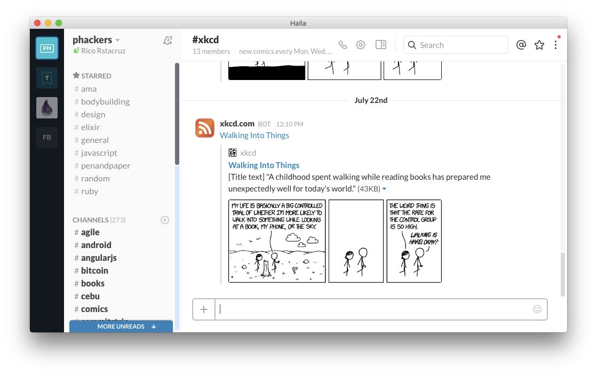

# Halla

> Minimal Slack wrapper app



Halla is yet another "native" app for accessing your Slack teams. It tries to be more conservative with resources. Halla is built on [nw.js], which takes less resources than [Electron][] (most other wrapper apps) or [MacGap][] (Slack official app).

**[Download Halla →](https://github.com/rstacruz/halla/releases)**

[](https://travis-ci.org/rstacruz/halla "See test builds")

[nw.js]: http://nwjs.io/
[Electron]: http://electron.atom.io/
[MacGap]: https://macgapproject.github.io/

## Config

Create a file called `~/.hallarc`. Add as many Slack teams here.

```dosini
[services.myteam]
name = My Slack
url = https://myteam.slack.com

[services.otherteam]
name = Their Slack
url = https://otherteam.slack.com
```

## Starting

```sh
git clone https://github.com/rstacruz/halla.git
cd halla
npm install
```

Run it with `npm start`. Note that it'll download nw.js on its first run (pretty big).

```sh
npm start
```

Or run it with the SDK (more resource-intensive, but has *Inspect Element*):

```sh
npm run start:sdk
```

## Packaging

This will create OSX `.app` files in `/dist`.

```sh
npm run dist
```

## Thanks

**halla** © 2016+, Rico Sta. Cruz. Released under the [MIT] License.<br>
Authored and maintained by Rico Sta. Cruz with help from contributors ([list][contributors]).

> [ricostacruz.com](http://ricostacruz.com) &nbsp;&middot;&nbsp;
> GitHub [@rstacruz](https://github.com/rstacruz) &nbsp;&middot;&nbsp;
> Twitter [@rstacruz](https://twitter.com/rstacruz)

[MIT]: http://mit-license.org/
[contributors]: http://github.com/rstacruz/halla/contributors
